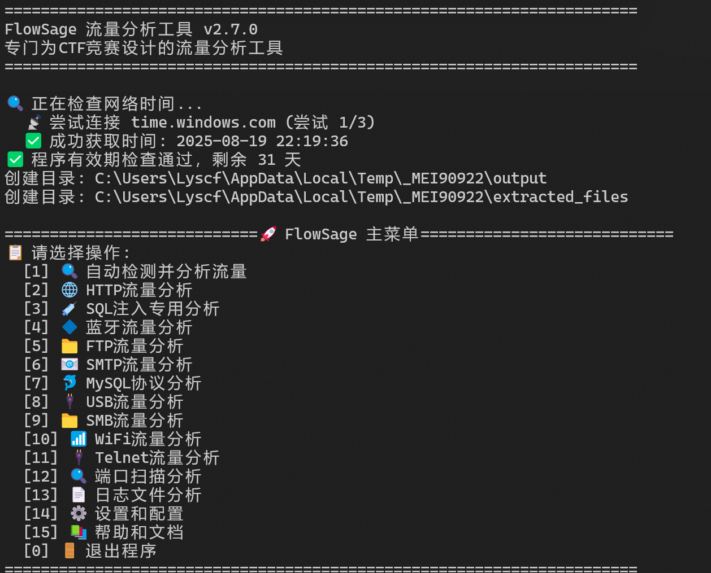
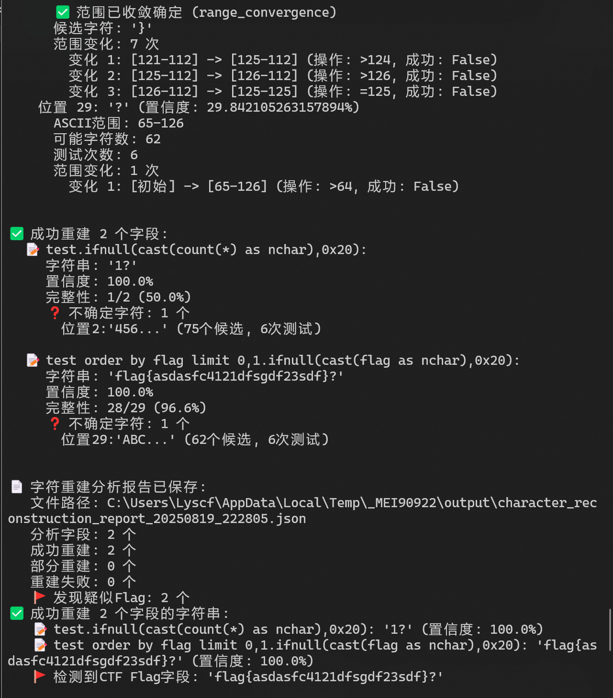
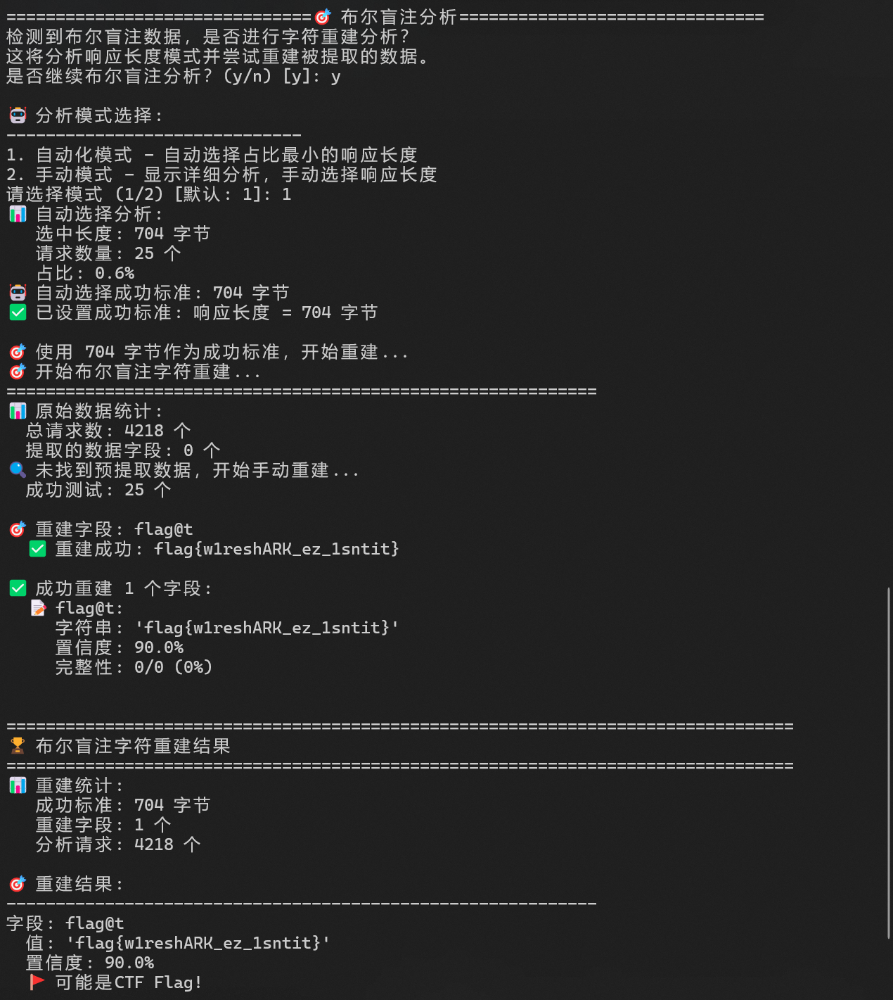
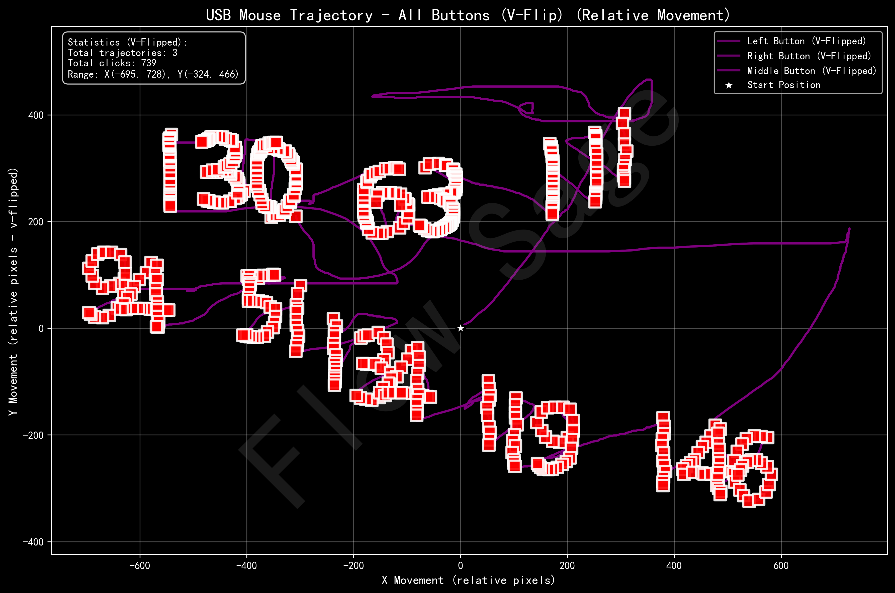
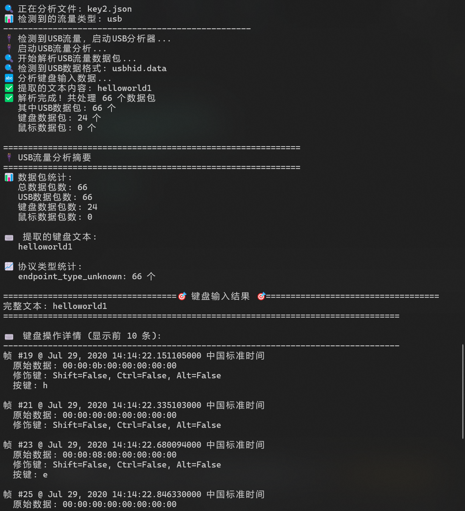
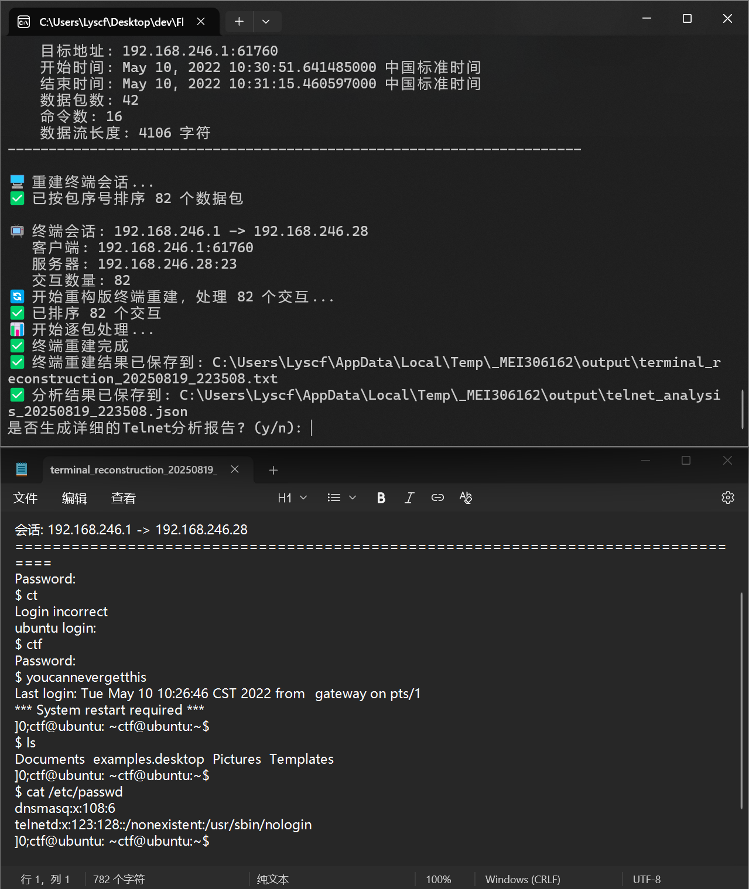
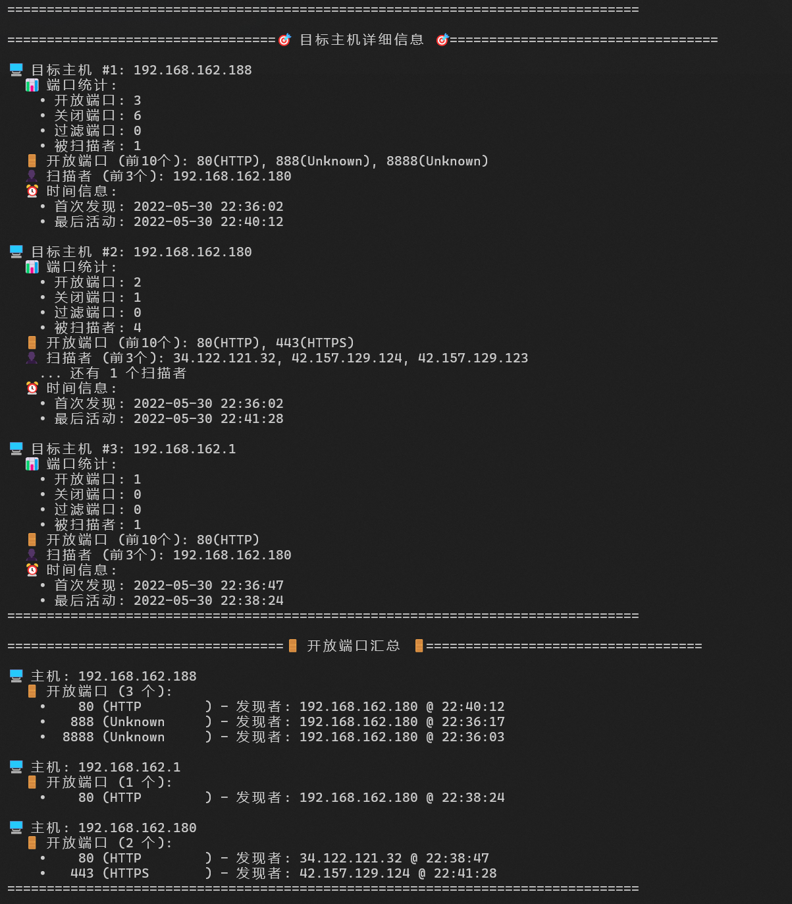
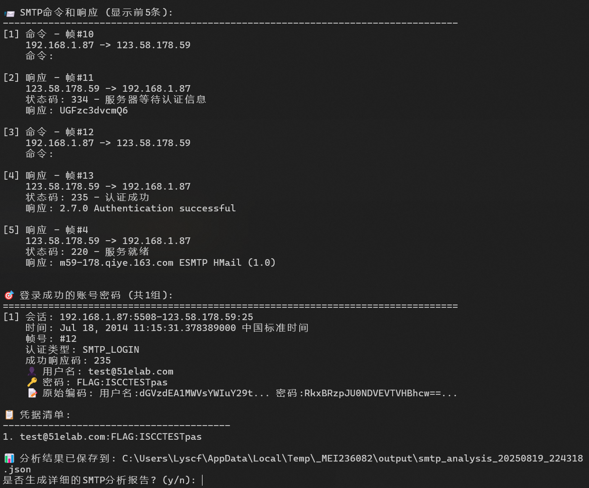

<div align="center">

# FlowSage

**🚀 专为CTF设计的智能流量分析工具**

[](https://github.com/Lyscf/FlowSage)
[](https://github.com/Lyscf/FlowSage)
[](https://github.com/Lyscf/FlowSage)

*零配置 • 智能分析 • CTF专用*

[功能特性](#功能特性) • [快速开始](#快速开始) • [使用文档](#使用文档) • [更新日志](#更新日志)

</div>

---

## 🎯 项目简介

FlowSage 是一款专为 CTF 比赛设计的流量分析工具，能够帮助选手快速、准确地从复杂的网络流量中提取关键信息。通过深度协议解析和智能算法，实现**一行命令完成复杂流量分析**。

> 💡 **注意**：本项目目前为闭源项目，欢迎有兴趣的开发者联系合作，CTFer可在Issues中提出功能需求和反馈。


> 💡 **注意**：本项目目前存在网络验证，使用公网NTP服务验证当前时间，一个版本可在版本发布后一个月内正常可用。


---

## 项目截图

<div align="center">

### 🖥️ 程序菜单


### 💉 SQL-时间盲注流量还原


### 🎯 SQL-布尔盲注流量还原


### 🖱️ USB鼠标流量还原


### ⌨️ USB键盘流量还原


### 🔌 Telnet流量分析-会话重建


### 🔍 端口扫描分析器


### 📧 SMTP流量分析器


</div>
---

## ✨ 功能特性

### 🔍 核心能力

- **🌐 全协议深度解析**：支持 HTTP、SQL、FTP、SMTP、Telnet、SMB、端口扫描、鼠标轨迹、键盘数据 等 12+ 主流协议
- **📁 智能文件识别**：自动识别 200+ 文件类型
- **🎌 CTF专属优化**：内置多层 Flag 检测算法，支持 15+ 种 Flag 格式
- **⚡ 零配置分析**：开箱即用，无需复杂配置
- **🎛️ 交互式菜单**：全新图形化操作界面，操作更便捷

### 🛠️ 专业功能

| 协议类型       | 分析能力                                          | CTF应用场景            |
| -------------- | ------------------------------------------------- | ---------------------- |
| **HTTP** | 会话重建 + 文件隐写检测 + 分段传输支持 + 自动文件提取 | Web取证、隐写分析      |
| **SQL**  | 智能盲注重建 + 多字段并行提取 + 增强型payload识别 | SQL注入分析、数据提取  |
| **USB**  | 扫描码转换 + 鼠标轨迹可视化 + 修饰键支持          | 键盘流量解析、输入重建 |
| **WiFi** | 握手包捕获 + 网络拓扑分析 + 弱加密检测            | 无线安全分析           |
| **FTP**  | 会话重建 + 文件传输分析 + 认证信息提取            | 文件传输取证           |
| **蓝牙** | 设备识别 + 数据包分析 + 连接日志提取              | 蓝牙设备取证           |
| **SMTP** | 邮件头解析 + 附件提取 + 垃圾邮件检测              | 邮件取证               |
| **SMB**  | 文件共享分析 + NTLM认证 + 会话重建                | 文件传输取证、认证分析  |
| **Telnet** | 密码爆破分析 + 终端内容还原 + 会话重建          | 远程登录取证、密码分析 |
| **端口扫描** | 扫描模式识别 + 工具特征分析 + 目标识别        | 网络侦察分析           |
| **鼠标轨迹** | 轨迹可视化 + 点击事件分析 + 操作序列重建      | 用户行为分析           |
| **键盘数据** | 按键序列还原 + 功能键识别 + 组合键解析        | 输入行为重建           |

### v2.7.0 新特性

- **🖱️ 鼠标轨迹解析器**：全新鼠标轨迹可视化和分析功能，支持用户操作行为重建
- **⌨️ 键盘数据还原**：智能键盘输入重建，支持功能按键和组合键识别，完整还原用户输入
- **🚀 SMB协议分析器**：新增文件共享和NTLM认证分析，支持Windows网络取证
- **🔍 端口扫描分析**：智能识别扫描模式和工具特征，支持多种扫描技术检测
- **⏰ NTP时间验证**：新增网络时间同步验证，确保分析结果的时间准确性
- **🎯 增强Flag提取**：优化CTF标志检测算法，提升识别准确率和覆盖面
- **🛠️ 用户体验优化**：改进交互界面，提供更友好的操作体验
- **🔧 稳定性提升**：修复已知问题，提升系统整体稳定性和可靠性


## 🚀 快速开始

### 系统要求

- Windows 10/11

### 安装步骤

1. **下载工具**

   ```bash
   # 从Release页面下载最新版本
   # 或联系开发者获取试用版本
   ```

2. **准备流量文件**

   - 使用 Wireshark 打开流量文件
   - 点击 **文件** → **导出分组解析结果**
   - 选择 **JSON** 格式保存
3. **运行分析**

   ```bash
   # 一键启动分析（新增交互式菜单）
   ./FlowSage.exe

   ```

### 快速示例

```bash
# 分析HTTP流量
./FlowSage.exe http_traffic.json

# 分析SQL注入流量  
./FlowSage.exe sql_injection.json

# 分析Telnet流量
./FlowSage.exe telnet_traffic.json

# 分析USB键盘流量
./FlowSage.exe usb_keyboard.json
```

## 📖 使用文档

### 🎛️ 交互式菜单

v2.5.0新增的交互式菜单让操作更加直观：

```text
============================🚀 FlowSage 主菜单============================
📋 请选择操作:
  [1] 🔍 自动检测并分析流量
  [2] 🌐 HTTP流量分析
  [3] 💉 SQL注入专用分析
  [4] 🔷 蓝牙流量分析
  [5] 📁 FTP流量分析
  [6] 📧 SMTP流量分析
  [7] 🐬 MySQL协议分析
  [8] 🔌 USB流量分析
  [9] 📁 SMB流量分析
  [10] 📶 WiFi流量分析
  [11] 🔌 Telnet流量分析
  [12] ⚙️ 设置和配置
  [13] 📚 帮助和文档
  [0] 🚪 退出程序
======================================================================
请选择 [0-13]:
```

**功能特性：**

- ✅ 完整的Telnet会话重建和解析
- ✅ 智能密码爆破检测和分析
- ✅ 终端内容完整还原
- ✅ 登录凭据自动提取
- ✅ 会话时间线重建

## 🏗️ 技术架构

### 算法优势

- **智能会话重建**：基于TCP序列号的精确重建算法，支持分段传输
- **多层Flag检测**：正则表达式 + 熵分析 + 格式验证 + 语义分析
- **自适应编码识别**：支持30+编码格式自动转换
- **损坏数据修复**：智能文件重组和数据恢复
- **Telnet会话分析**：完整终端内容还原和密码破解检测
- **HTTP文件自动提取**：智能识别并提取所有传输文件

## 📈 性能指标

| 指标                 | 表现   | 说明                   |
| -------------------- | ------ | ---------------------- |
| **Flag检出率** | 95%+   | 基于500+CTF题目测试    |
| **协议覆盖率** | 9+协议 | HTTP、SQL、USB、WiFi、Telnet等 |

## 🔄 更新日志

### v2.7.0 (2025-08-19)

- **🖱️ 鼠标轨迹解析器**：重构鼠标轨迹可视化和分析功能，支持用户操作行为重建
- **⌨️ 键盘数据还原**：重构键盘输入重建，支持功能按键和组合键识别，完整还原用户输入
- **🚀 SMB协议分析器**：新增文件共享和NTLM认证分析，支持Windows网络取证
- **⏰ NTP时间验证**：重构网络时间同步验证，保证软件可用性
- **🎯 增强Flag提取**：优化CTF标志检测算法，提升识别准确率和覆盖面
- **🔧 稳定性提升**：修复已知问题，提升系统整体稳定性和可靠性

### v2.6.0 (2025-08-17)

- 🚀 **增强SQL注入分析器**：新增反向时间盲注检测算法，检测准确率提升
- 🎯 **优化标志提取器**：支持冒号格式标志检测，增强多种CTF标志格式识别能力
- 🔧 **Telnet功能重构**：改进终端重建算法，提升会话解析准确性和稳定性
- ⚡ **HTTP分析优化**：移除404和200状态码请求数量限制，支持更全面的流量分析
- 🛠️ **配置管理升级**：全新模块化配置架构，支持FTP、SMTP、SQL注入等模块独立配置
- 📡 **网络检查功能**：新增网络连接状态检测，提升工具运行稳定性
- 📊 **日志分析器**：新增专用访问日志分析模块，支持Web服务器日志智能解析
- 🏗️ **架构重构优化**：重构报告生成模块，优化项目结构，提升代码可维护性
- 🐛 **修复文件处理**：优化文件名处理逻辑，修复特殊字符文件名解析问题

### v2.5.0 (2025-08-08)

- 📡 **新增Telnet协议支持**：完整的Telnet会话解析和重建功能
- 🔐 **Telnet密码分析**：智能识别弱密码、爆破攻击和登录凭据
- 💻 **终端内容还原**：完整重现Telnet会话的终端操作和命令执行
- 📁 **HTTP文件自动提取**：默认自动提取所有HTTP传输的文件，无需手动操作

### v2.3.0 (2025-08-05)

- 🔧 **重构SQL解析器**：全新算法架构，检测准确率提升至98%+
- 🎛️ **新增交互式菜单**：菜单操作菜单，支持多种分析模式选择
- 🚩 **增强Flag匹配**：支持15+种Flag格式，包括变形和隐藏格式
- 📡 **HTTP 206分段传输**：完整支持分段响应的智能重组和分析
- ⚡ **性能大幅优化**：分析速度提升40%，内存占用降低30%

### v2.2.0 (2025-08-02)

- ✨ 优化SQL注入分析算法，提高检测准确率至95%+
- 🔧 增强USB键盘流量解析，支持更多键盘布局
- 🐛 修复FTP文件传输分析中的编码问题
- 📊 新增HTML可视化报告功能

### v2.1.0 (2025-07-30)

- 🏗️ 全面重构项目架构，采用模块化设计
- 🔍 增强SQL注入分析，支持多种注入技术
- 🖱️ 优化USB键盘流量解析，支持鼠标轨迹分析
- 🌐 统一HTTP处理器，整合所有HTTP功能

## 🤝 贡献指南

虽然本项目暂时闭源，但我们非常欢迎社区贡献：

### 💡 需求反馈

- 在 [Issues](https://github.com/Lyscf/FlowSage/issues) 中提出功能需求
- 分享 CTF 题目和流量样本
- 反馈使用体验和建议

### 🤝 合作机会

- CTF题库建设
- 新功能开发
- 测试和文档完善

## 📞 联系我们

- **技术支持**: lyscf#proton.me (将#替换为@)
- **Bug反馈**: [GitHub Issues](https://github.com/Lyscf/FlowSage/issues)

## 📄 许可证

本项目目前为专有软件，未经授权禁止复制、分发和修改。

**⭐ 如果这个项目对你有帮助，请给我们一个Star！**

Made with ❤️ for CTF Community

## 📝 免责声明

本项目仅供学习和研究使用，使用者需遵守相关法律法规，确保合法合规使用。我们不对因使用本项目而导致的任何法律责任或损失承担责任。
